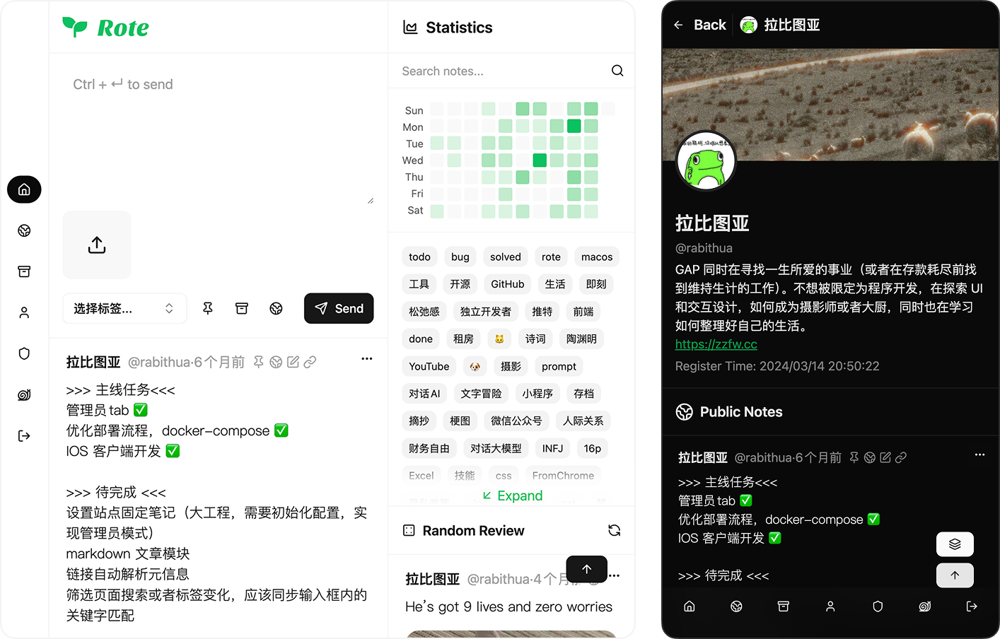

<p align="right"><a href="../README.md">English</a> | 中文</p>


[](https://opensource.org/licenses/MIT)
[](https://github.com/Rabithua/Rote)
[](https://github.com/Rabithua/Rote/fork)

**[Demo](https://demo.rote.ink/)** ｜ **[Website](https://rote.ink)** ｜ **[iOS APP](https://apps.apple.com/us/app/rote/id6755513897)** ｜ **[Explore](https://rote.ink/explore)** ｜ **[Rabithua](https://rote.ink/rabithua)**

> 开放 API，记录的姿势不止一种 🤩，支持 Self-Hosted，对自己的数据掌握主动权，来去自由，没有数据绑架 🙅🏻

### 预览



### 核心特性

- **保持克制**：一切为了优雅的笔记体验和克制的互动体验
- **低心智负担**：更少的压力和更简单直观的记录体验乃至部署体验
- **开放接口**：开放 API 接口，支持在任意的场景记录或者获取数据
- **无拘无束**：完全掌控你的数据，自由导出数据
- **自托管部署**：使用 Docker 或者 Dokploy 一键部署
- **分离架构**：前后端采用分离的架构设计，按需部署你需要的服务
- **Markdown 文章**：独立文章支持，可被笔记引用，提供纯粹的读写体验
- **iOS 客户端**：更优雅的 App 客户端

### 快速开始

#### 方式一：使用 Docker Hub 镜像

复制 `docker-compose.yml` 到你的已经装好 Docker 和 Docker Compose 的服务器

> 注意：如果你使用反向代理的话，VITE_API_BASE 应该是你反向代理后的后端地址

```bash
# 使用最新版本（默认配置文件）
VITE_API_BASE=http://<your-ip-address>:18000 docker-compose up -d

# 使用特定版本
IMAGE_TAG=v1.0.0 docker-compose up -d
```

#### 方式二：使用 Dokploy（推荐）

Dokploy 是一个开源的 Docker 部署平台，提供了可视化的应用部署和管理界面。如果你已经安装了 Dokploy，可以通过模板一键部署 Rote。

1. 访问 Dokploy：打开你的 Dokploy 管理界面
2. 选择模板：在应用模板列表中找到并选择 Rote 模板
3. 部署应用：点击部署按钮，Dokploy 会自动拉取镜像并启动所有服务
4. 配置域名（可选）：默认部署使用的是 Dokploy 自动生成的域名，如果需要为你的 Rote 配置自定义域名，请记得在环境变量中设置 VITE_API_BASE 为你的域名地址（例如：http://your-domain.com 或 https://your-domain.com）

### 详细说明

更多部署选项和配置说明，请查看 `doc/` 目录下的文档：

- [自托管部署指南](https://rote.ink/doc/selfhosted) - 完整的部署和配置说明
- [API 文档](doc/userguide/API-ENDPOINTS.md) - API 接口使用指南
- [API Key 指南](doc/userguide/API-KEY-GUIDE.md) - 如何使用 API Key

## 技术栈


