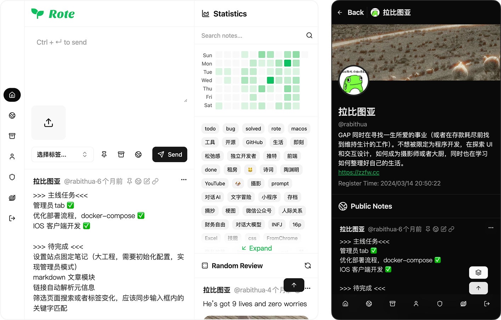

<p align="right"><a href="../README.md">English</a> | 中文</p>

<p>
  <picture>
    <source media="(prefers-color-scheme: dark)" srcset="assets/imgs/v2.0-dark.svg">
    
  </picture>
</p>

<p>
  <picture>
    <source media="(prefers-color-scheme: dark)" srcset="assets/imgs/logo-dark.svg">
    
  </picture>
</p>

[](https://opensource.org/licenses/MIT)
[](https://github.com/Rabithua/Rote)
[](https://github.com/Rabithua/Rote/fork)

**[Demo](https://demo.rote.ink/)** ｜ **[Website](https://rote.ink)** ｜ **[iOS APP](https://apps.apple.com/us/app/rote/id6755513897)** ｜ **[Explore](https://rote.ink/explore)** ｜ **[Rabithua](https://rote.ink/rabithua)**

> 开放 API，记录的姿势不止一种 🤩，支持 Self-Hosted，对自己的数据掌握主动权，来去自由，没有数据绑架 🙅🏻

### 预览



### 核心特性

- **保持克制**：一切为了优雅的笔记体验和克制的互动体验
- **低心智负担**：更少的压力和更简单直观的记录体验乃至部署体验
- **开放接口**：开放 API 接口，支持在任意的场景记录或者获取数据
- **无拘无束**：完全掌控你的数据，自由导出数据
- **自托管部署**：使用 Docker 或者 Dokploy 一键部署
- **分离架构**：前后端采用分离的架构设计，按需部署你需要的服务
- **Markdown 文章**：独立文章支持，可被笔记引用，提供纯粹的读写体验
- **记忆**：可选的 AI 对话、语义搜索、相关笔记、流式回答和来源引用，基于你自己的笔记与文章工作
- **管理员控制 AI**：AI、向量存储、自动索引和公开 Explore 语义发现默认关闭，必须由管理员显式启用
- **iOS 客户端**：更优雅的 App 客户端

### 快速开始

#### 方式一：使用 Docker Hub 镜像

复制 [docker-compose.yml](../docker-compose.yml) 到你的已经装好 Docker 和 Docker Compose 的服务器

> 注意：如果你使用反向代理的话，VITE_API_BASE 应该是你反向代理后的后端地址
>
> Rote 现在默认使用 `pgvector/pgvector:pg17-trixie`。它保持 PostgreSQL 17 行为，并额外支持可选的 AI 向量扩展。普通 `postgres:17` 只作为临时兼容路径，后续 Rote 版本可能不再支持。
>
> `latest` 是稳定版镜像。如果你正在阅读 develop 分支文档，或者测试尚未发布的记忆能力，请使用 `IMAGE_TAG=develop`。

```bash
# 1. 在 docker-compose.yml 旁边创建 .env 文件
cat > .env <<'EOF'
VITE_API_BASE=http://YOUR_SERVER_IP:18000
POSTGRES_PASSWORD=change_this_password
EOF

# 2. 首次启动前，请替换 YOUR_SERVER_IP 和 change_this_password。
#    请使用高强度且 URL 安全的数据库密码，避免在 POSTGRES_PASSWORD 中使用 @ : / # % 等字符。
#    数据库卷初始化后，请保持这个密码不变。

# 3. 使用最新稳定镜像启动 Rote
docker compose up -d
```

可选 `.env` 配置：

```bash
# 使用特定版本
IMAGE_TAG=v1.0.0

# 使用 develop 分支镜像测试尚未发布的新功能
IMAGE_TAG=develop

# 不使用 pgvector，继续使用普通 PostgreSQL
# 仅作为兼容路径；后续 Rote 版本可能要求使用支持 pgvector 的 PostgreSQL。
POSTGRES_IMAGE=postgres:17
```

容器启动后：

1. 打开 `http://<your-ip-address>:18001`。
2. 在初始化页面创建第一个管理员账号。
3. 登录后进入管理员后台完成站点配置。
4. 可选：如果当前镜像包含记忆能力，进入 `管理 -> AI 相关` 配置对话模型和向量模型，启用 pgvector，并为存量笔记/文章建立索引。

#### 方式二：使用 Dokploy（推荐）

Dokploy 是一个开源的 Docker 部署平台，提供了可视化的应用部署和管理界面。如果你已经安装了 Dokploy，可以通过模板一键部署 Rote。

1. 访问 Dokploy：打开你的 Dokploy 管理界面
2. 选择模板：在应用模板列表中找到并选择 Rote 模板
3. 部署应用：点击部署按钮，Dokploy 会自动拉取镜像并启动所有服务
4. 配置域名（可选）：默认部署使用的是 Dokploy 自动生成的域名，如果需要为你的 Rote 配置自定义域名，请记得在环境变量中设置 VITE_API_BASE 为你的域名地址（例如：http://your-domain.com 或 https://your-domain.com）

### iOS App：接入自托管后端

iOS App 支持连接到你自部署的后端。

1. 在登录页连续点击顶部欢迎文字，会弹出配置框。
2. 将 `API Base` 修改为你自部署后端的公网地址（或反向代理地址）。
3. 按正常流程登录即可。

### 记忆

记忆是可选能力，默认关闭。它已经可以在 `develop` 镜像中使用，并会在包含记忆的下一个稳定版发布后进入稳定镜像。管理员可以在 `管理 -> AI 相关` 配置对话模型和向量模型后启用。Rote 支持 OpenAI-compatible 供应商，包括 OpenAI、OpenRouter、Ollama / LM Studio、DeepSeek、SiliconFlow、DashScope / Qwen、Zhipu GLM、Moonshot / Kimi、Volcengine Ark、Tencent Hunyuan、Baidu Qianfan，以及自定义 OpenAI-compatible 接口。

只有已登录且已认证的用户可以使用 AI 功能。AI 对话只保存在当前浏览器会话中，不会持久化写入数据库。只有在管理员开启 AI 向量存储和自动索引后，笔记与文章才会进入向量索引。

### 详细说明

更多部署选项和配置说明，请查看 `doc/` 目录下的文档：

- [自托管部署指南](https://rote.ink/doc/selfhosted) - 完整的部署和配置说明
- [API 文档](userguide/API-ENDPOINTS.md) - API 接口使用指南
- [API Key 指南](userguide/API-KEY-GUIDE.md) - 如何使用 API Key
- [AI Vector 迁移指南](userguide/AI-VECTOR-MIGRATION.zh.md) - 旧版线上数据库升级到记忆与 pgvector 的操作说明
- [用户本地 AI 指南](userguide/LOCAL-AI.zh.md) - 在用户自己的电脑运行 Gemma，模型请求不经过 Rote 服务端
- [Rote Pro 订阅接入设计](paid-subscription-integration.zh.md) - 官方实例的可选订阅授权投影方案
- [Rote Pro 服务端实施计划](paid-subscription-plan.zh.md) - 服务端分阶段任务与验收标准

### 视频教程（B 站）

- [本地部署教程](https://www.bilibili.com/video/BV1vc6iBfE1F)
- [使用 Dokploy 部署 Rote](https://www.bilibili.com/video/BV1z96vBeEYr)

### 社区项目

- [Raycast 插件](https://github.com/aBER0724/rote-raycast) - Rote 的 Raycast 插件，由 [@aBER0724](https://github.com/aBER0724) 开发
- [Rerote](https://github.com/Rabithua/Rerote) - 将其他平台（当前支持 Memos）的数据转换为 Rote 格式的数据转换工具
- [Rotefeeder](https://github.com/Rabithua/Rotefeeder) - 基于 Deno 的 RSS/Atom 订阅转发服务，通过 OpenKey 定时将内容发送到 Rote
- [Rote Toolkit](https://github.com/Rabithua/rote-toolkit) - 基于 TypeScript 的 Rote 增强工具包，提供强大的 CLI 工具和用于 AI 集成的 MCP 服务
- [Rote Skill](https://github.com/Rabithua/rote-skill) - 用于 AI Agent 通过 rote-toolkit 与 Rote 交互的可复用技能

## 技术栈


